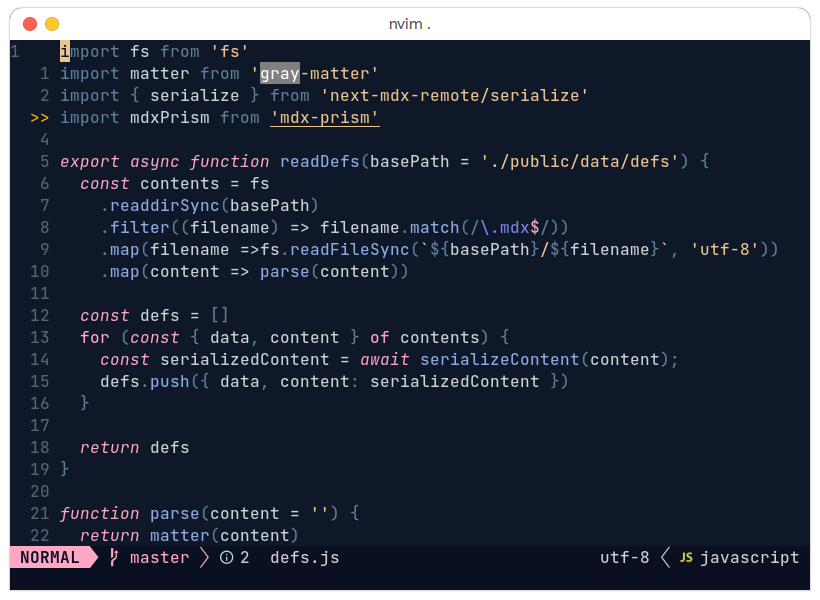
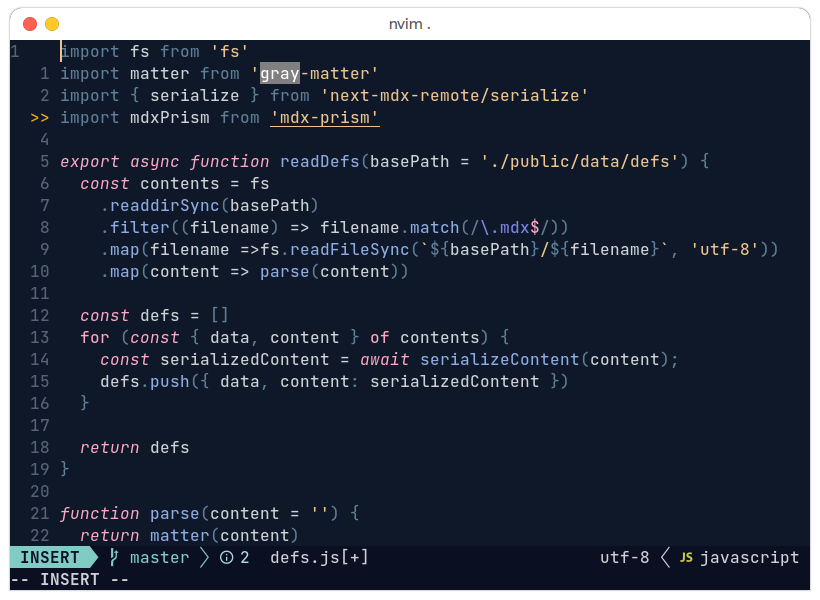
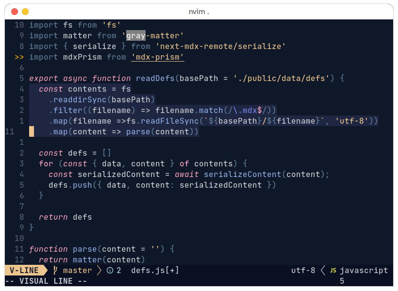
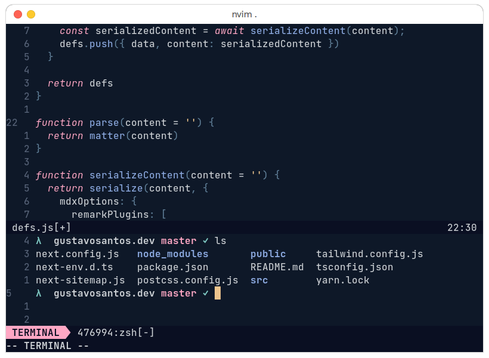
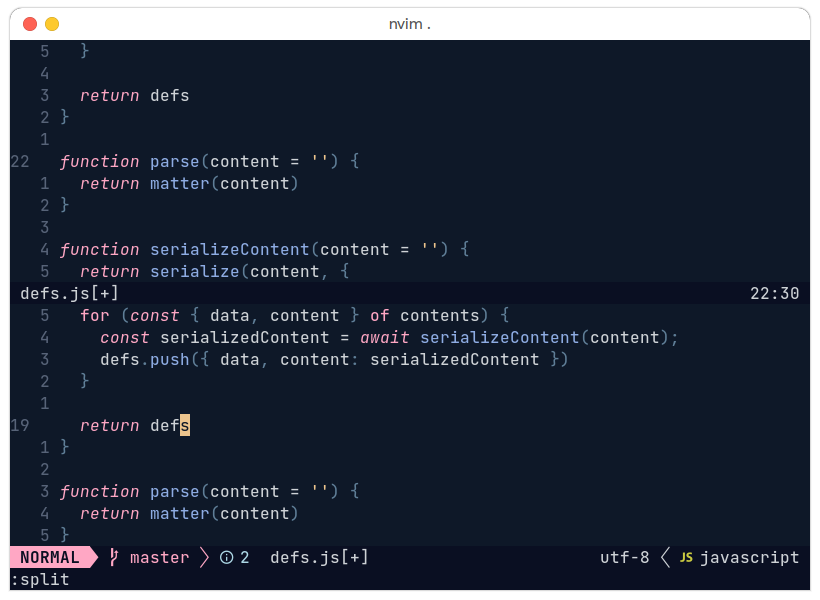

# nightcrawler

A neovim colorscheme created using [lush.nvim](https://github.com/rktjmp/lush.nvim).

## Instalation

Using `vim-plug`, add these lines into your config file:

```vim
Plug 'rktjmp/lush.nvim'
Plug 'gustavofsantos/nightcrawler.nvim'
```

Then select the colorscheme:

```vim
colorscheme nightcrawler
```

## Screenshots






